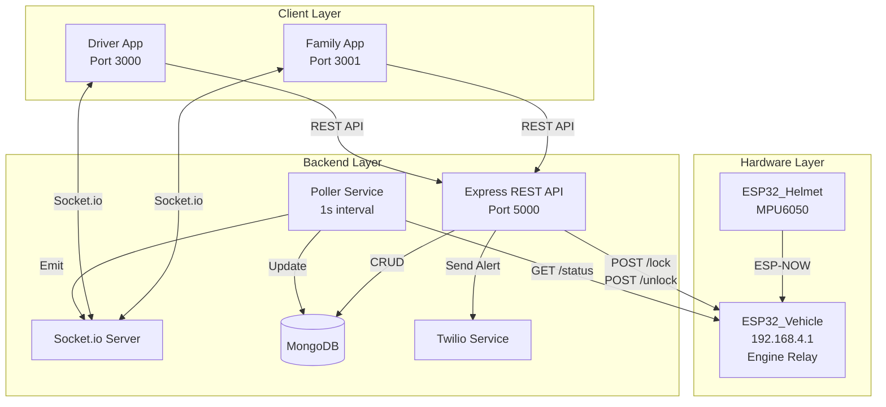
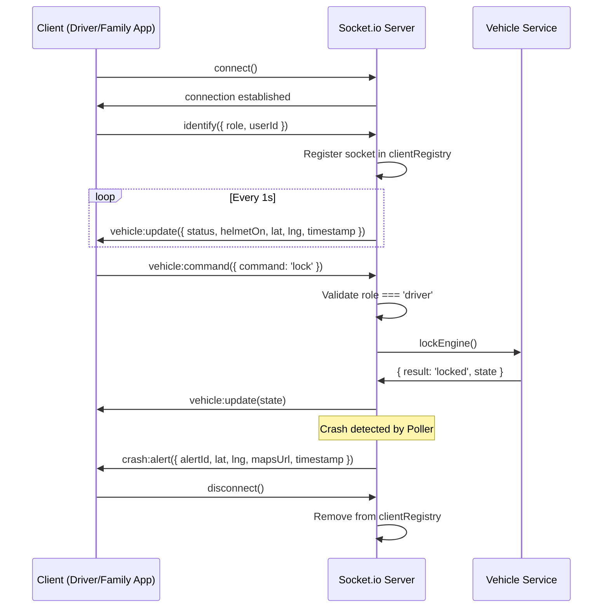

# Design Document: SmartHelmet MERN System

## Overview

The SmartHelmet system is a full-stack IoT safety platform that connects helmet-mounted and vehicle-mounted ESP32 microcontrollers to a Node.js backend, which serves two React applications: a Driver App and a Family App. The system provides real-time crash detection, automated emergency response, remote engine control, and live vehicle telemetry monitoring.

### Key Components

- **ESP32_Helmet**: Helmet-mounted microcontroller with MPU6050 accelerometer for crash detection
- **ESP32_Vehicle**: Vehicle-mounted microcontroller acting as WiFi AP (192.168.4.1) with engine relay control
- **Backend**: Node.js + Express + Socket.io + MongoDB server on port 5000
- **Driver_App**: React application on port 3000 for driver control and monitoring
- **Family_App**: React application on port 3001 for family member monitoring and emergency response

### Communication Flow

```
ESP32_Helmet (ESP-NOW) → ESP32_Vehicle (HTTP) ← Backend (Polling + Commands)
                                                      ↓
                                            Socket.io Broadcast
                                                      ↓
                                        Driver_App + Family_App
```

---

## Architecture

### System Architecture Diagram



### Technology Stack

**Backend:**
- Node.js with Express 5.x
- Socket.io for WebSocket communication
- Mongoose for MongoDB ODM
- JWT (jsonwebtoken) for authentication
- bcryptjs for password hashing
- Twilio SDK for WhatsApp/SMS alerts
- axios for ESP32 HTTP polling
- web-push for browser notifications

**Frontend:**
- React 18.x
- Socket.io-client for real-time updates
- React Router for navigation
- Axios for HTTP requests
- Leaflet or Google Maps API for GPS visualization

**Hardware:**
- ESP32 with Arduino framework
- ESP-NOW protocol for helmet-vehicle communication
- MPU6050 accelerometer library
- AsyncWebServer for HTTP endpoints
- ArduinoJson for JSON serialization

---

## Components and Interfaces

### Backend Services

#### 1. Auth Service (`/api/auth`)

**Responsibilities:**
- User registration and login
- JWT token generation and validation
- Role-based access control middleware

**Endpoints:**
- `POST /api/auth/register` - Create new user account
- `POST /api/auth/login` - Authenticate and return JWT
- `GET /api/auth/me` - Get authenticated user profile

**Middleware:**
- `authenticate()` - Verify JWT and attach user to request
- `requireRole(role)` - Enforce role-based access

#### 2. Vehicle Service (`/api/vehicle`)

**Responsibilities:**
- Forward lock/unlock commands to ESP32_Vehicle
- Retrieve current vehicle state
- Handle command timeouts and errors

**Endpoints:**
- `POST /api/vehicle/lock` - Lock engine (driver only)
- `POST /api/vehicle/unlock` - Unlock engine (driver only)
- `GET /api/vehicle/status` - Get current vehicle state

**ESP32 Integration:**
- HTTP client to `http://192.168.4.1/lock` and `/unlock`
- 3-second timeout for commands
- Retry logic with exponential backoff

#### 3. Alert Service (`/api/alerts`)

**Responsibilities:**
- Persist crash alerts to MongoDB
- Retrieve alert history
- Handle alert acknowledgment
- Trigger Twilio notifications

**Endpoints:**
- `GET /api/alerts` - Get 50 most recent alerts
- `PATCH /api/alerts/:id/acknowledge` - Mark alert as acknowledged

**Alert Creation Flow:**
1. Poller detects `status: CRASH`
2. Create Alert document with GPS coordinates
3. Emit `crash:alert` via Socket.io
4. Send WhatsApp message via Twilio
5. Trigger web push notifications

#### 4. Ride Service (`/api/rides`)

**Responsibilities:**
- Manage ride session lifecycle
- Track ride history per driver

**Endpoints:**
- `POST /api/rides/start` - Start new ride session (driver only)
- `PATCH /api/rides/:id/end` - End active ride session (driver only)
- `GET /api/rides` - Get driver's ride history

#### 5. Push Service (`/api/push`)

**Responsibilities:**
- Store web push subscriptions
- Send push notifications on crash alerts
- Clean up invalid subscriptions

**Endpoints:**
- `POST /api/push/subscribe` - Store push subscription

**Push Notification Flow:**
1. Family_App requests notification permission
2. Service worker generates subscription
3. Frontend sends subscription to backend
4. On crash alert, backend sends push to all family subscriptions

#### 6. Poller Service (Background)

**Responsibilities:**
- Poll ESP32_Vehicle every 1 second
- Update VehicleState singleton in MongoDB
- Detect crash events and trigger alert flow
- Broadcast updates via Socket.io

**Polling Logic:**
```javascript
setInterval(async () => {
  try {
    const response = await axios.get('http://192.168.4.1/status', { timeout: 2000 });
    const { status, helmetOn, lat, lng } = response.data;
    
    // Update MongoDB
    await VehicleState.findOneAndUpdate(
      {},
      { status, helmetOn, lat, lng, timestamp: new Date() },
      { upsert: true }
    );
    
    // Broadcast to clients
    io.emit('vehicle:update', { status, helmetOn, lat, lng, timestamp: new Date() });
    
    // Check for crash
    if (status === 'CRASH') {
      await handleCrashDetected(lat, lng);
    }
  } catch (error) {
    console.error('Polling error:', error.message);
  }
}, 1000);
```

#### 7. Socket Server

**Responsibilities:**
- Manage WebSocket connections
- Associate sockets with authenticated users
- Broadcast vehicle updates and crash alerts
- Handle vehicle commands from Driver_App

**Socket Events:**

**Client → Server:**
- `identify` - `{ role, userId }` - Associate socket with user
- `vehicle:command` - `{ command: 'lock' | 'unlock' }` - Driver command

**Server → Client:**
- `vehicle:update` - `{ status, helmetOn, lat, lng, timestamp }` - Live vehicle state
- `crash:alert` - `{ alertId, lat, lng, mapsUrl, timestamp }` - Crash notification
- `vehicle:error` - `{ message }` - Command error response

**Connection Management:**
```javascript
io.on('connection', (socket) => {
  socket.on('identify', ({ role, userId }) => {
    socket.join(`user:${userId}`);
    socket.data.role = role;
    socket.data.userId = userId;
  });
  
  socket.on('vehicle:command', async ({ command }) => {
    if (socket.data.role !== 'driver') {
      socket.emit('vehicle:error', { message: 'Unauthorized' });
      return;
    }
    // Forward command to ESP32
  });
  
  socket.on('disconnect', () => {
    // Cleanup
  });
});
```

---

## Data Models

### User Schema

```javascript
const UserSchema = new mongoose.Schema({
  email: {
    type: String,
    required: true,
    unique: true,
    lowercase: true,
    trim: true
  },
  password: {
    type: String,
    required: true,
    minlength: 6
  },
  phoneNumber: {
    type: String,
    required: true,
    unique: true
  },
  role: {
    type: String,
    enum: ['driver', 'family'],
    required: true
  },
  linkedDriverPhone: {
    type: String,
    required: function() { return this.role === 'family'; }
  },
  createdAt: {
    type: Date,
    default: Date.now
  }
});

// Pre-save hook to hash password
UserSchema.pre('save', async function(next) {
  if (!this.isModified('password')) return next();
  this.password = await bcrypt.hash(this.password, 10);
  next();
});

// Method to compare passwords
UserSchema.methods.comparePassword = async function(candidatePassword) {
  return await bcrypt.compare(candidatePassword, this.password);
};
```

### VehicleState Schema (Singleton)

```javascript
const VehicleStateSchema = new mongoose.Schema({
  status: {
    type: String,
    enum: ['IDLE', 'RUNNING', 'CRASH'],
    default: 'IDLE'
  },
  helmetOn: {
    type: Boolean,
    default: false
  },
  lat: {
    type: Number,
    required: true,
    min: -90,
    max: 90
  },
  lng: {
    type: Number,
    required: true,
    min: -180,
    max: 180
  },
  timestamp: {
    type: Date,
    default: Date.now
  }
});

// Ensure only one document exists
VehicleStateSchema.index({}, { unique: true });
```

### Alert Schema

```javascript
const AlertSchema = new mongoose.Schema({
  lat: {
    type: Number,
    required: true,
    min: -90,
    max: 90
  },
  lng: {
    type: Number,
    required: true,
    min: -180,
    max: 180
  },
  timestamp: {
    type: Date,
    default: Date.now,
    required: true
  },
  acknowledged: {
    type: Boolean,
    default: false
  },
  acknowledgedAt: {
    type: Date
  },
  acknowledgedBy: {
    type: mongoose.Schema.Types.ObjectId,
    ref: 'User'
  }
});

AlertSchema.index({ timestamp: -1 });
```

### Ride Schema

```javascript
const RideSchema = new mongoose.Schema({
  driverId: {
    type: mongoose.Schema.Types.ObjectId,
    ref: 'User',
    required: true
  },
  startTime: {
    type: Date,
    default: Date.now,
    required: true
  },
  endTime: {
    type: Date
  },
  status: {
    type: String,
    enum: ['active', 'completed'],
    default: 'active'
  }
});

RideSchema.index({ driverId: 1, startTime: -1 });
```

### PushSubscription Schema

```javascript
const PushSubscriptionSchema = new mongoose.Schema({
  userId: {
    type: mongoose.Schema.Types.ObjectId,
    ref: 'User',
    required: true
  },
  endpoint: {
    type: String,
    required: true,
    unique: true
  },
  keys: {
    p256dh: { type: String, required: true },
    auth: { type: String, required: true }
  },
  createdAt: {
    type: Date,
    default: Date.now
  }
});

PushSubscriptionSchema.index({ userId: 1 });
```

---

```

### Data Flow

1. **Polling Flow**: Backend Poller → ESP32_Vehicle `/status` → Update MongoDB Vehicle_State → Emit Socket.io `vehicle:update`
2. **Crash Detection Flow**: ESP32_Helmet detects crash → ESP-NOW to ESP32_Vehicle → Vehicle sets status=CRASH → Poller reads CRASH → Create Alert in DB → Emit `crash:alert` → Send Twilio WhatsApp → Trigger web push
3. **Vehicle Control Flow**: Driver App → Socket.io `vehicle:command` OR REST `/api/vehicle/lock` → Backend → HTTP POST to ESP32_Vehicle → Response → Update clients
4. **Authentication Flow**: Client → POST `/api/auth/register` or `/api/auth/login` → Backend validates → Return JWT → Client stores in localStorage → Include in Authorization header

---

## Components and Interfaces

### Backend Components

#### 1. Express Server (`server.js`)
- Initializes Express app with CORS, JSON middleware
- Connects to MongoDB via Mongoose
- Mounts route handlers for `/api/auth`, `/api/vehicle`, `/api/alerts`, `/api/rides`, `/api/push`
- Initializes Socket.io server attached to HTTP server
- Starts Poller service on server startup
- Listens on port 5000

#### 2. Poller Service (`services/poller.js`)
- Runs `setInterval` every 1000ms
- Makes HTTP GET to `http://192.168.4.1/status` with 2s timeout
- On success: Updates `VehicleState` singleton in MongoDB, emits `vehicle:update` via Socket.io
- On `status === 'CRASH'`: Calls `AlertService.createCrashAlert()`, emits `crash:alert`, triggers Twilio and web push
- On failure: Logs error, continues polling without crashing

#### 3. Auth Service (`services/authService.js`)
- `register(email, password, phone, role, linkedDriverPhone)`: Creates User, hashes password with bcrypt, returns JWT
- `login(email, password)`: Validates credentials, returns JWT
- `verifyToken(token)`: Decodes JWT, returns user payload
- Middleware: `authenticate` (validates JWT), `requireRole(role)` (checks user role)

#### 4. Vehicle Service (`services/vehicleService.js`)
- `lockEngine()`: POST to `http://192.168.4.1/lock`, returns updated state
- `unlockEngine()`: POST to `http://192.168.4.1/unlock`, returns updated state
- `getVehicleState()`: Fetches latest `VehicleState` from MongoDB
- Timeout: 3 seconds for ESP32 commands

#### 5. Alert Service (`services/alertService.js`)
- `createCrashAlert(lat, lng, timestamp)`: Creates `Alert` document with `acknowledged: false`
- `getAlerts(limit)`: Returns recent alerts sorted by timestamp descending
- `acknowledgeAlert(alertId)`: Sets `acknowledged: true`

#### 6. Ride Service (`services/rideService.js`)
- `startRide(driverId)`: Creates `Ride` with `status: 'active'`, `startTime: Date.now()`
- `endRide(rideId, driverId)`: Updates `Ride` with `endTime`, `status: 'completed'`, validates ownership
- `getRides(driverId)`: Returns all rides for driver

#### 7. Push Service (`services/pushService.js`)
- `subscribe(userId, subscription)`: Stores web push subscription object
- `sendCrashNotification(alertId, lat, lng)`: Sends push to all family member subscriptions
- `removeInvalidSubscription(subscriptionId)`: Cleans up failed subscriptions

#### 8. Socket Server (`socket/socketServer.js`)
- Manages connected clients in a Map: `socketId → { userId, role, socket }`
- Event handlers:
  - `identify`: Associates socket with userId and role
  - `vehicle:command`: Validates role=driver, calls VehicleService, emits result or error
  - `disconnect`: Removes socket from registry
- Broadcast methods:
  - `broadcastVehicleUpdate(state)`: Emits `vehicle:update` to all clients
  - `broadcastCrashAlert(alert)`: Emits `crash:alert` to all clients

---

## Data Models

### User Schema (`models/User.js`)

```javascript
{
  email: { type: String, required: true, unique: true, lowercase: true },
  password: { type: String, required: true }, // bcrypt hashed
  phone: { type: String, required: true },
  role: { type: String, enum: ['driver', 'family'], required: true },
  linkedDriverPhone: { type: String }, // Only for family members
  createdAt: { type: Date, default: Date.now }
}
```

**Indexes**: `email` (unique), `phone`

---

### VehicleState Schema (`models/VehicleState.js`)

```javascript
{
  _id: { type: String, default: 'singleton' }, // Singleton document
  status: { type: String, enum: ['IDLE', 'DRIVING', 'CRASH'], default: 'IDLE' },
  helmetOn: { type: Boolean, default: false },
  lat: { type: Number, default: 0 },
  lng: { type: Number, default: 0 },
  timestamp: { type: Date, default: Date.now }
}
```

**Singleton Pattern**: Only one document exists with `_id: 'singleton'`. Poller uses `findOneAndUpdate` with `upsert: true`.

---

### Alert Schema (`models/Alert.js`)

```javascript
{
  lat: { type: Number, required: true },
  lng: { type: Number, required: true },
  timestamp: { type: Date, required: true },
  acknowledged: { type: Boolean, default: false },
  mapsUrl: { type: String }, // Computed: `https://www.google.com/maps?q=${lat},${lng}`
  createdAt: { type: Date, default: Date.now }
}
```

**Indexes**: `timestamp` (descending), `acknowledged`

---

### Ride Schema (`models/Ride.js`)

```javascript
{
  driverId: { type: mongoose.Schema.Types.ObjectId, ref: 'User', required: true },
  startTime: { type: Date, required: true },
  endTime: { type: Date },
  status: { type: String, enum: ['active', 'completed'], default: 'active' }
}
```

**Indexes**: `driverId`, `startTime` (descending)

---

### PushSubscription Schema (`models/PushSubscription.js`)

```javascript
{
  userId: { type: mongoose.Schema.Types.ObjectId, ref: 'User', required: true },
  subscription: { type: Object, required: true }, // { endpoint, keys: { p256dh, auth } }
  createdAt: { type: Date, default: Date.now }
}
```

**Indexes**: `userId`

---

## API Routes

### Authentication Routes (`routes/auth.js`)

| Method | Endpoint | Auth | Role | Description |
|--------|----------|------|------|-------------|
| POST | `/api/auth/register` | No | - | Register new user (driver or family) |
| POST | `/api/auth/login` | No | - | Login and receive JWT |
| GET | `/api/auth/me` | Yes | - | Get authenticated user profile |

**Request/Response Examples**:

```javascript
// POST /api/auth/register
Request: {
  email: "driver@example.com",
  password: "securepass123",
  phone: "+1234567890",
  role: "driver"
}
Response: {
  token: "eyJhbGciOiJIUzI1NiIsInR5cCI6IkpXVCJ9...",
  user: { id, email, phone, role }
}

// POST /api/auth/login
Request: { email: "driver@example.com", password: "securepass123" }
Response: { token: "...", user: { id, email, phone, role } }

// GET /api/auth/me
Headers: { Authorization: "Bearer <token>" }
Response: { id, email, phone, role, linkedDriverPhone }
```

---

### Vehicle Routes (`routes/vehicle.js`)

| Method | Endpoint | Auth | Role | Description |
|--------|----------|------|------|-------------|
| POST | `/api/vehicle/lock` | Yes | driver | Lock engine relay |
| POST | `/api/vehicle/unlock` | Yes | driver | Unlock engine relay |
| GET | `/api/vehicle/state` | Yes | - | Get latest vehicle state |

**Request/Response Examples**:

```javascript
// POST /api/vehicle/lock
Headers: { Authorization: "Bearer <token>" }
Response: { result: "locked", state: { status, helmetOn, lat, lng, timestamp } }

// POST /api/vehicle/unlock
Headers: { Authorization: "Bearer <token>" }
Response: { result: "unlocked", state: { status, helmetOn, lat, lng, timestamp } }

// GET /api/vehicle/state
Headers: { Authorization: "Bearer <token>" }
Response: { status: "DRIVING", helmetOn: true, lat: 28.7041, lng: 77.1025, timestamp: "2024-01-15T10:30:00Z" }
```

---

### Alert Routes (`routes/alerts.js`)

| Method | Endpoint | Auth | Role | Description |
|--------|----------|------|------|-------------|
| GET | `/api/alerts` | Yes | - | Get last 50 alerts |
| PATCH | `/api/alerts/:id/acknowledge` | Yes | - | Acknowledge an alert |

**Request/Response Examples**:

```javascript
// GET /api/alerts
Headers: { Authorization: "Bearer <token>" }
Response: [
  { _id, lat: 28.7041, lng: 77.1025, timestamp: "2024-01-15T10:30:00Z", acknowledged: false, mapsUrl: "..." },
  ...
]

// PATCH /api/alerts/:id/acknowledge
Headers: { Authorization: "Bearer <token>" }
Response: { _id, lat, lng, timestamp, acknowledged: true, mapsUrl }
```

---

### Ride Routes (`routes/rides.js`)

| Method | Endpoint | Auth | Role | Description |
|--------|----------|------|------|-------------|
| POST | `/api/rides/start` | Yes | driver | Start a new ride session |
| PATCH | `/api/rides/:id/end` | Yes | driver | End a ride session |
| GET | `/api/rides` | Yes | driver | Get all rides for authenticated driver |

**Request/Response Examples**:

```javascript
// POST /api/rides/start
Headers: { Authorization: "Bearer <token>" }
Response: { _id, driverId, startTime: "2024-01-15T10:00:00Z", status: "active" }

// PATCH /api/rides/:id/end
Headers: { Authorization: "Bearer <token>" }
Response: { _id, driverId, startTime, endTime: "2024-01-15T11:00:00Z", status: "completed" }

// GET /api/rides
Headers: { Authorization: "Bearer <token>" }
Response: [
  { _id, driverId, startTime, endTime, status: "completed" },
  { _id, driverId, startTime, status: "active" },
  ...
]
```

---

### Push Routes (`routes/push.js`)

| Method | Endpoint | Auth | Role | Description |
|--------|----------|------|------|-------------|
| POST | `/api/push/subscribe` | Yes | family | Subscribe to web push notifications |

**Request/Response Examples**:

```javascript
// POST /api/push/subscribe
Headers: { Authorization: "Bearer <token>" }
Request: {
  subscription: {
    endpoint: "https://fcm.googleapis.com/fcm/send/...",
    keys: { p256dh: "...", auth: "..." }
  }
}
Response: { success: true, message: "Subscription saved" }
```

---

## Socket.io Event Definitions

### Client → Server Events

| Event | Payload | Auth | Description |
|-------|---------|------|-------------|
| `identify` | `{ role: 'driver'|'family', userId: string }` | Yes | Associates socket with user |
| `vehicle:command` | `{ command: 'lock'|'unlock' }` | Yes (driver) | Send lock/unlock command |

---

### Server → Client Events

| Event | Payload | Description |
|-------|---------|-------------|
| `vehicle:update` | `{ status, helmetOn, lat, lng, timestamp }` | Broadcast vehicle state update |
| `crash:alert` | `{ alertId, lat, lng, mapsUrl, timestamp }` | Broadcast crash alert |
| `vehicle:error` | `{ message: string }` | Send error to specific client |

---

### Socket.io Connection Flow



---

## ESP32 Poller Service Design

### Poller Implementation (`services/poller.js`)

```javascript
const axios = require('axios');
const VehicleState = require('../models/VehicleState');
const AlertService = require('./alertService');
const { broadcastVehicleUpdate, broadcastCrashAlert } = require('../socket/socketServer');

const ESP32_URL = 'http://192.168.4.1';
const POLL_INTERVAL = 1000; // 1 second
const REQUEST_TIMEOUT = 2000; // 2 seconds

let pollerInterval = null;

async function pollVehicle() {
  try {
    const response = await axios.get(`${ESP32_URL}/status`, { timeout: REQUEST_TIMEOUT });
    const { status, helmetOn, lat, lng } = response.data;
    const timestamp = new Date();

    // Update MongoDB singleton
    const vehicleState = await VehicleState.findOneAndUpdate(
      { _id: 'singleton' },
      { status, helmetOn, lat, lng, timestamp },
      { upsert: true, new: true }
    );

    // Broadcast to all connected clients
    broadcastVehicleUpdate({ status, helmetOn, lat, lng, timestamp });

    // Handle crash detection
    if (status === 'CRASH') {
      const alert = await AlertService.createCrashAlert(lat, lng, timestamp);
      broadcastCrashAlert(alert);
    }
  } catch (error) {
    console.error('[Poller] Failed to poll ESP32:', error.message);
    // Continue polling without crashing
  }
}

function startPoller() {
  if (pollerInterval) return;
  console.log('[Poller] Starting vehicle state poller...');
  pollerInterval = setInterval(pollVehicle, POLL_INTERVAL);
}

function stopPoller() {
  if (pollerInterval) {
    clearInterval(pollerInterval);
    pollerInterval = null;
    console.log('[Poller] Stopped vehicle state poller');
  }
}

module.exports = { startPoller, stopPoller };
```

### Poller Error Handling

- **Network Timeout**: If ESP32 doesn't respond within 2s, log error and retry on next interval
- **Invalid Response**: If response is malformed, log error and skip update
- **MongoDB Failure**: If database write fails, log error but continue polling
- **Crash Loop Prevention**: Never throw unhandled exceptions; always catch and log

---

## Driver App Component Structure

### Component Hierarchy

```
DriverApp/
├── App.jsx (Router, Auth Context)
├── pages/
│   ├── LoginPage.jsx
│   ├── RegisterPage.jsx
│   └── DashboardPage.jsx
├── components/
│   ├── StatusRing.jsx (Animated status indicator)
│   ├── GPSDisplay.jsx (Lat/Lng display)
│   ├── ControlButtons.jsx (Lock/Unlock buttons)
│   ├── CrashOverlay.jsx (Full-screen crash alert)
│   └── RideControls.jsx (Start/End ride buttons)
├── hooks/
│   ├── useAuth.js (JWT management, login/logout)
│   ├── useSocket.js (Socket.io connection, event handlers)
│   └── useVehicleState.js (Vehicle state management)
├── services/
│   ├── api.js (Axios instance with JWT interceptor)
│   └── socket.js (Socket.io client instance)
└── utils/
    └── vibration.js (Vibration patterns)
```

### Key Components

#### DashboardPage.jsx
- Connects to Socket.io on mount, emits `identify` with driver role
- Subscribes to `vehicle:update` and `crash:alert` events
- Displays StatusRing, GPSDisplay, ControlButtons, RideControls
- Shows CrashOverlay when `crash:alert` received

#### StatusRing.jsx
- Displays circular status indicator with color coding:
  - Green: IDLE
  - Blue: DRIVING
  - Red: CRASH
- Animates transitions with CSS

#### ControlButtons.jsx
- Lock button: Emits `vehicle:command({ command: 'lock' })`
- Unlock button: Emits `vehicle:command({ command: 'unlock' })`
- Disables buttons during command execution
- Shows loading spinner while waiting for response

#### CrashOverlay.jsx
- Full-screen red overlay with crash icon
- Plays alarm sound (looping)
- Triggers vibration pattern: `[1000, 500, 1000, 500, 1000]`
- Displays GPS coordinates and "Open Maps" button
- Acknowledge button calls `PATCH /api/alerts/:id/acknowledge`

---

## Family App Component Structure

### Component Hierarchy

```
FamilyApp/
├── App.jsx (Router, Auth Context)
├── pages/
│   ├── LoginPage.jsx (Includes linkedDriverPhone field)
│   ├── RegisterPage.jsx (Includes linkedDriverPhone field)
│   └── MonitoringPage.jsx
├── components/
│   ├── LiveStatus.jsx (Real-time driver status display)
│   ├── CrashModal.jsx (Crash alert modal with emergency actions)
│   ├── AlertHistory.jsx (List of past alerts)
│   └── EmergencyButton.jsx (Call 112 button)
├── hooks/
│   ├── useAuth.js (JWT management, login/logout)
│   ├── useSocket.js (Socket.io connection, event handlers)
│   ├── useNotifications.js (Web Push API integration)
│   └── useVehicleState.js (Vehicle state management)
├── services/
│   ├── api.js (Axios instance with JWT interceptor)
│   ├── socket.js (Socket.io client instance)
│   └── pushService.js (Web Push subscription management)
└── utils/
    └── vibration.js (SOS vibration pattern)
```

### Key Components

#### MonitoringPage.jsx
- Connects to Socket.io on mount, emits `identify` with family role
- Subscribes to `vehicle:update` and `crash:alert` events
- Requests notification permission on first load
- Displays LiveStatus and AlertHistory
- Shows CrashModal when `crash:alert` received

#### LiveStatus.jsx
- Displays driver's current status (IDLE/DRIVING/CRASH)
- Shows helmet status (on/off)
- Displays GPS coordinates
- Updates in real-time via `vehicle:update` events

#### CrashModal.jsx
- Modal overlay with crash details
- Displays GPS coordinates and "Open Maps" link
- EmergencyButton to call 112
- Acknowledge button calls `PATCH /api/alerts/:id/acknowledge`
- Plays alarm sound (looping)
- Triggers SOS vibration: `[1000, 500, 1000, 500, 1000]`
- Sends browser push notification via `pushService.sendNotification()`

#### AlertHistory.jsx
- Fetches alerts from `GET /api/alerts` on mount
- Displays list with timestamp, GPS link, and acknowledgement status
- Allows acknowledging unacknowledged alerts

---

## Error Handling

### Backend Error Handling Strategy

#### 1. Global Error Middleware (`middleware/errorHandler.js`)

```javascript
function errorHandler(err, req, res, next) {
  console.error('[Error]', err);

  if (err.name === 'ValidationError') {
    return res.status(400).json({ error: 'Validation failed', details: err.message });
  }

  if (err.name === 'JsonWebTokenError') {
    return res.status(401).json({ error: 'Invalid token' });
  }

  if (err.name === 'TokenExpiredError') {
    return res.status(401).json({ error: 'Token expired' });
  }

  if (err.code === 11000) { // MongoDB duplicate key
    return res.status(409).json({ error: 'Resource already exists' });
  }

  res.status(err.status || 500).json({
    error: err.message || 'Internal server error'
  });
}
```

#### 2. HTTP Error Classes

```javascript
class NotFoundError extends Error {
  constructor(message) {
    super(message);
    this.status = 404;
  }
}

class UnauthorizedError extends Error {
  constructor(message) {
    super(message);
    this.status = 401;
  }
}

class ForbiddenError extends Error {
  constructor(message) {
    super(message);
    this.status = 403;
  }
}

class TimeoutError extends Error {
  constructor(message) {
    super(message);
    this.status = 504;
  }
}
```

#### 3. Service-Level Error Handling

- **VehicleService**: Wrap ESP32 HTTP calls in try-catch, throw `TimeoutError` on timeout
- **AuthService**: Throw `UnauthorizedError` for invalid credentials, `ConflictError` for duplicate email
- **AlertService**: Throw `NotFoundError` if alert ID doesn't exist
- **RideService**: Throw `ForbiddenError` if user tries to end another driver's ride

#### 4. Poller Error Handling

- Never throw unhandled exceptions
- Log all errors with context (timestamp, error message, stack trace)
- Continue polling on next interval
- Optionally: Implement exponential backoff if ESP32 is unreachable for extended period

---

### Frontend Error Handling Strategy

#### 1. API Error Interceptor (`services/api.js`)

```javascript
import axios from 'axios';

const api = axios.create({
  baseURL: 'http://localhost:5000/api',
  timeout: 5000
});

// Request interceptor: Add JWT
api.interceptors.request.use(config => {
  const token = localStorage.getItem('token');
  if (token) {
    config.headers.Authorization = `Bearer ${token}`;
  }
  return config;
});

// Response interceptor: Handle errors
api.interceptors.response.use(
  response => response,
  error => {
    if (error.response?.status === 401) {
      localStorage.removeItem('token');
      window.location.href = '/login';
    }
    return Promise.reject(error);
  }
);

export default api;
```

#### 2. Socket.io Error Handling

```javascript
socket.on('connect_error', (error) => {
  console.error('Socket connection failed:', error);
  // Show toast notification: "Connection lost. Retrying..."
});

socket.on('vehicle:error', (data) => {
  console.error('Vehicle command failed:', data.message);
  // Show toast notification with error message
});
```

#### 3. Component-Level Error Boundaries

```javascript
class ErrorBoundary extends React.Component {
  state = { hasError: false };

  static getDerivedStateFromError(error) {
    return { hasError: true };
  }

  componentDidCatch(error, errorInfo) {
    console.error('React error:', error, errorInfo);
  }

  render() {
    if (this.state.hasError) {
      return <div>Something went wrong. Please refresh the page.</div>;
    }
    return this.props.children;
  }
}
```

#### 4. User-Facing Error Messages

- **Network Errors**: "Unable to connect to server. Check your internet connection."
- **Authentication Errors**: "Session expired. Please log in again."
- **Vehicle Command Errors**: "Failed to lock/unlock vehicle. Please try again."
- **Crash Alert Errors**: "Failed to acknowledge alert. Please try again."

---

## Testing Strategy

### Backend Testing

#### Unit Tests
- **Auth Service**: Test registration with duplicate email, login with invalid credentials, JWT generation and verification
- **Vehicle Service**: Test lock/unlock commands with mocked axios, timeout handling
- **Alert Service**: Test alert creation, acknowledgement, fetching with pagination
- **Ride Service**: Test ride start/end, ownership validation
- **Middleware**: Test `authenticate` with valid/invalid/expired tokens, `requireRole` with different roles

#### Integration Tests
- **API Routes**: Test full request/response cycle for each endpoint with real MongoDB (use test database)
- **Socket.io**: Test event emission and broadcasting with multiple connected clients
- **Poller**: Test polling cycle with mocked ESP32 server, crash detection flow

#### End-to-End Tests
- **Crash Flow**: Simulate ESP32 crash status → Verify alert created → Verify Socket.io emission → Verify Twilio call
- **Vehicle Control Flow**: Driver locks vehicle → Verify ESP32 receives command → Verify state update → Verify Socket.io broadcast

### Frontend Testing

#### Unit Tests
- **Hooks**: Test `useAuth` login/logout, `useSocket` connection/disconnection, `useVehicleState` state updates
- **Components**: Test StatusRing color changes, ControlButtons emit correct events, CrashOverlay displays correct data

#### Integration Tests
- **Dashboard Flow**: Test login → Socket.io connection → Receive vehicle update → Display updated state
- **Crash Alert Flow**: Test receive crash alert → Display overlay → Play sound → Trigger vibration → Acknowledge alert

#### Snapshot Tests
- **UI Components**: Snapshot tests for StatusRing, GPSDisplay, CrashOverlay, AlertHistory

### Testing Tools
- **Backend**: Jest, Supertest, mongodb-memory-server, socket.io-client (for testing Socket.io)
- **Frontend**: Jest, React Testing Library, MSW (Mock Service Worker for API mocking)

### Test Coverage Goals
- Backend: 80% code coverage
- Frontend: 70% code coverage
- Critical paths (crash detection, vehicle control, authentication): 100% coverage

---

## Security Considerations

### Authentication & Authorization
- Passwords hashed with bcrypt (salt rounds: 10)
- JWTs signed with HS256, secret stored in environment variable
- JWT expiration: 7 days
- Role-based access control enforced on all protected routes
- Middleware validates JWT on every request

### Data Protection
- MongoDB connection uses authentication (username/password in MONGO_URI)
- Sensitive data (Twilio credentials, JWT secret) stored in `.env`, never committed to git
- CORS configured to allow only trusted origins (Driver_App, Family_App)

### ESP32 Communication
- ESP32_Vehicle runs on local network (192.168.4.1), not exposed to internet
- Backend polls ESP32 from same network
- Consider adding API key authentication for ESP32 endpoints in production

### Rate Limiting
- Implement rate limiting on authentication endpoints (e.g., 5 login attempts per minute per IP)
- Use `express-rate-limit` middleware

### Input Validation
- Validate all request bodies with Joi or express-validator
- Sanitize user inputs to prevent NoSQL injection

---

## Deployment Considerations

### Backend Deployment
- Deploy to cloud platform (AWS EC2, Heroku, DigitalOcean)
- Use PM2 or systemd for process management
- Configure environment variables on server
- Set up MongoDB Atlas for production database
- Enable HTTPS with SSL certificate (Let's Encrypt)

### Frontend Deployment
- Build React apps with `npm run build`
- Deploy to static hosting (Netlify, Vercel, AWS S3 + CloudFront)
- Configure environment variables for API URL and Socket.io URL
- Enable HTTPS

### ESP32 Deployment
- Flash firmware to ESP32_Vehicle and ESP32_Helmet
- Configure WiFi credentials for ESP32_Vehicle
- Pair ESP32_Helmet with ESP32_Vehicle via ESP-NOW MAC address
- Mount ESP32_Helmet in helmet, ESP32_Vehicle in vehicle
- Connect engine relay to ESP32_Vehicle GPIO pin

### Monitoring & Logging
- Use Winston or Pino for structured logging
- Set up log aggregation (e.g., Loggly, Papertrail)
- Monitor server health with Uptime Robot or Pingdom
- Set up alerts for critical errors (crash detection failures, database connection loss)

---

## Future Enhancements

1. **Multi-Driver Support**: Allow family members to link to multiple drivers
2. **Historical GPS Tracking**: Store GPS coordinates for each ride, display route on map
3. **Crash Severity Detection**: Use MPU6050 data to estimate crash severity
4. **Voice Alerts**: Use Web Speech API to announce crash alerts
5. **Offline Mode**: Cache vehicle state in IndexedDB, sync when connection restored
6. **Admin Dashboard**: Web interface for system monitoring and user management
7. **Mobile Apps**: Native iOS/Android apps with better push notification support
8. **Geofencing**: Alert family if driver leaves predefined area
9. **Speed Monitoring**: Alert if driver exceeds speed limit
10. **Battery Monitoring**: Track ESP32 battery levels, alert on low battery

